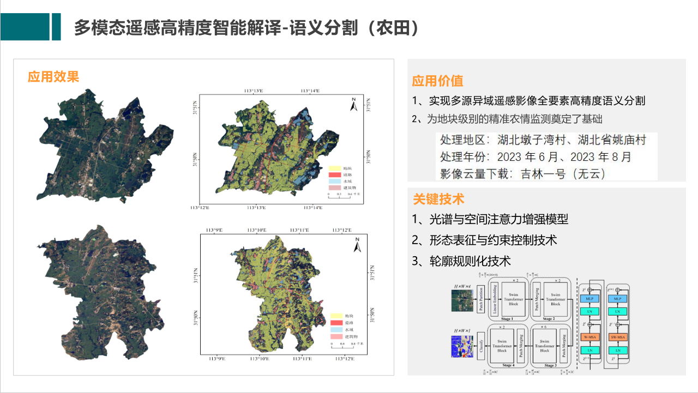
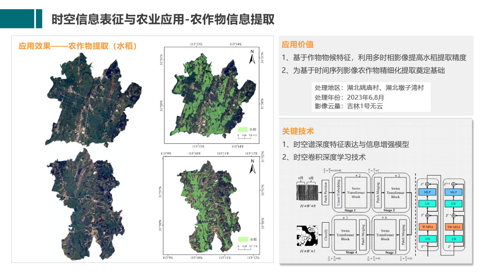
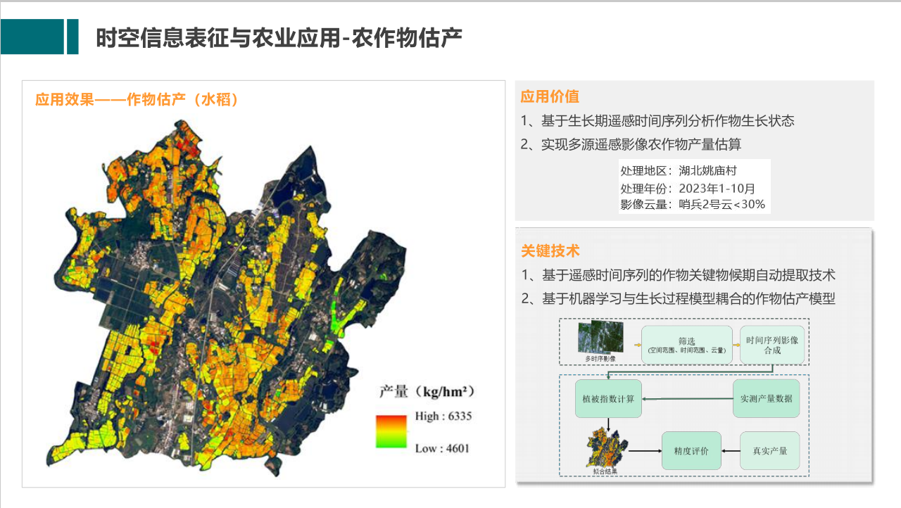
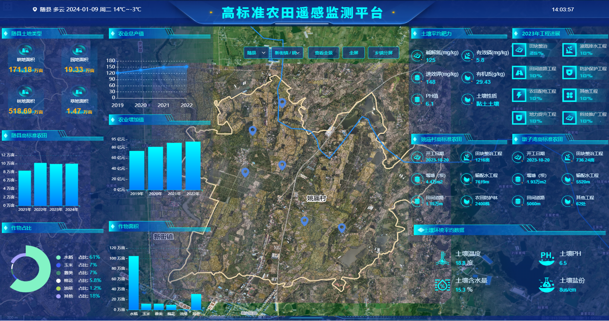
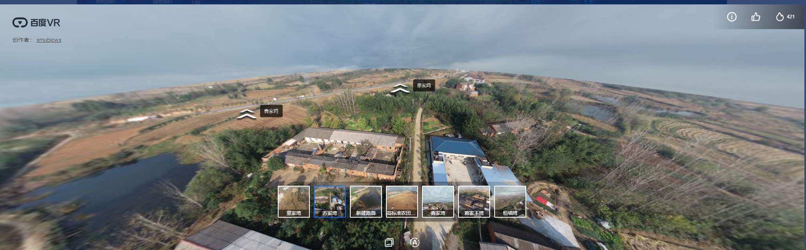
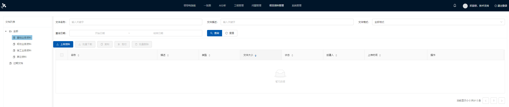

# 智慧农业-高标准农田监管平台-遥感监测-AI识别

#### 介绍
智慧农业-高标准农田监管平台-遥感监测AI识别地物分类，数据大屏、领导驾驶舱
农作物提取（水稻），产量预估，地物分隔模型算法已成熟

WeChat: 2609375767
#### 软件架构
软件架构说明

前端：vue/leaflet

后台：spring-boot

APP：原生安卓

#### 系统截图
1. 语义分隔

   
2.农作物提取（水稻）

3. 产量预估

4. 领导驾驶舱

5. 全景图   

6. 卷帘效果

7. 项目材料清单

